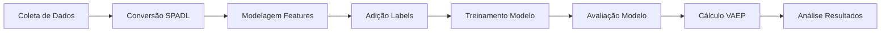

```mermaid
flowchart LR
    A[Coleta de Dados] --> B[Conversão SPADL]
    B --> C[Modelagem Features]
    C --> D[Adição Labels]
    D --> E[Treinamento Modelo]
    E --> F[Avaliação Modelo]
    F --> G[Cálculo VAEP]
    G --> H[Análise Resultados]
```
