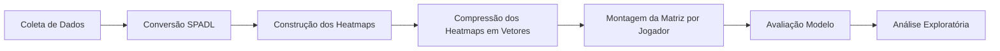

```mermaid
flowchart LR
    A[Coleta de Dados] --> B[Conversão SPADL]
    B --> C[Construção dos Heatmaps]
    C --> D[Compressão dos Heatmaps em Vetores]
    D --> E[Montagem da Matriz por Jogador]
    E --> F[Avaliação Modelo]
    F --> G[Análise Exploratória]
```
